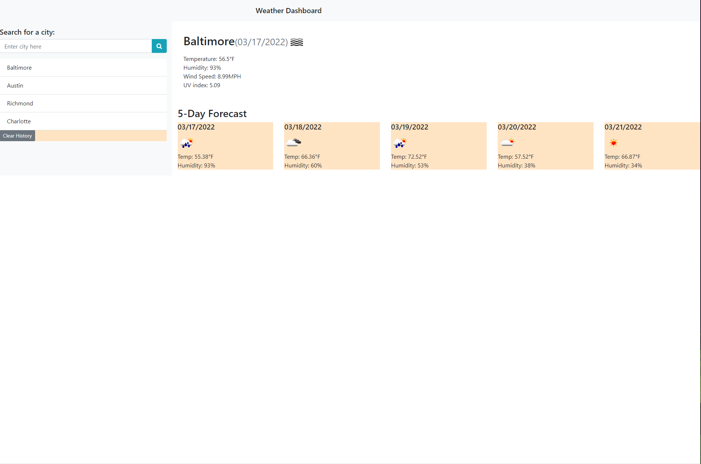

# Weather-Dashboard

https://obtains.github.io/Weather-Dashboard/

Mada an acc with OpenWeather API to get an API Key.

Created Weather Dashboard to use API to get correct weather data.

Created a clear function to remove previous history inquires without having to restart page.

Used fontawesome to get icons.

Used bootstrap to get dimeisions on weather boxes.

